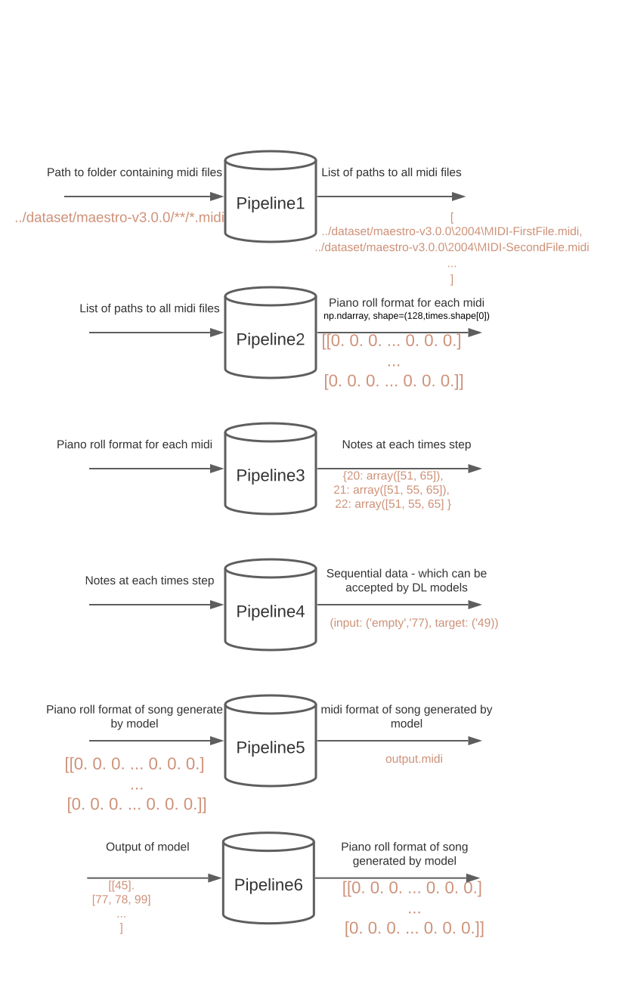

# Piano music generator

This is a repo for generating one instrument music (default piano - can be changed to other instrument).
It's based upon TensorFlow, Magenta, numpy Libraries.
It's consist of few modules.

- model.py - defines architectures of models - you can add your architecture and train it.
- download.py - download MEASTRO dataset, call it before it
- trainer.py - defines process of training.
- train.py - runs process of training, reads hyperparameters from config files.
- finetune.py - runs finetunning of already existing model.h, reads hyperparameters from config files.
- eval.py - evalutes models generated from process of training from train.py and generate music. (midi format), reads data from config files. Starts midi vizualizer.
- midi vizualizer folder - Small JavaScript program based upon MagentaJS used to visualize music
- utlis folder:
  - pipelines - defines the process of sequential data transformation.
  - project_utils - logging functionality etc.
- settings.yml - can be overwrited to define new parameters of training.
- settings_eval.yml - can be overwrited to define new parameters of evaluation.

# Before training download dataset

```sh
python download.py
```

# Training

```sh
 python train.py
```

# Finetunning

```sh
python finetune.py
```

# Evaluation

```sh
python eval.py
```

## How this project processed data - system of sequentails pipelines (Example)


